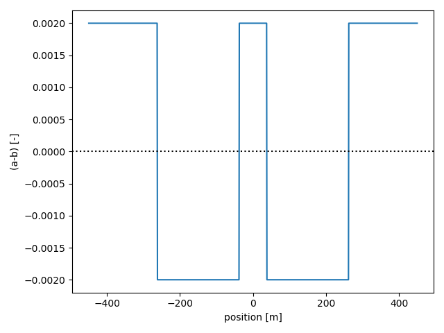
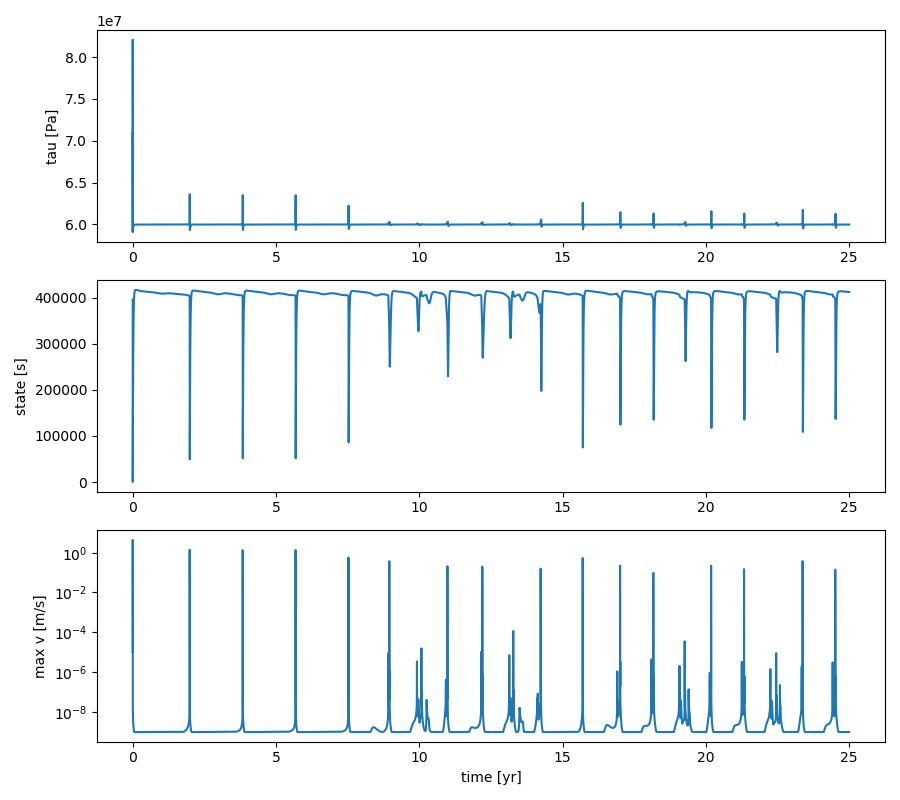
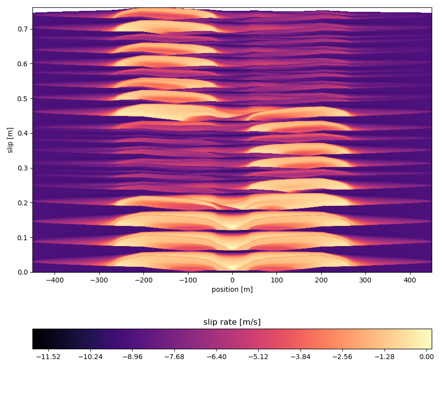

## Double asperity simulations

In this tutorial, we'll consider a fault with two asperities, one of size $f L_a$, and another of size $(1-f)L_a$. We begin with $f = 0.5$, meaning that both asperities are of equal size $0.5 L_a$. Later on, we can tune this parameter $f$ to see how the behaviour changes. The corresponding Jupyter Notebook file is found in `examples/notebooks/double_asperity.ipynb`.

```python
# Make plots interactive in the notebook
%matplotlib notebook

import matplotlib.pyplot as plt
import numpy as np

import os
import sys

# Add QDYN source directory to PATH
# Go up in the directory tree
upup = [os.pardir]*2
qdyn_dir = os.path.join(*upup)
# Get QDYN src directory
src_dir = os.path.abspath(
    os.path.join(
        os.path.join(os.path.abspath(""), qdyn_dir), "src")
)
# Append src directory to Python path
sys.path.append(src_dir)
# Get QDYN plotting library directory
plot_dir = os.path.abspath(
    os.path.join(
        os.path.join(os.path.abspath(""), qdyn_dir), "utils", "post_processing")
)
# Append plotting library directory to Python path
sys.path.append(plot_dir)

# Import QDYN wrapper and plotting library
from pyqdyn import qdyn
import plot_functions as qdyn_plot
```

To preprare a simulation, the global simulation and mesh parameters will have to be specified. This is done in three steps: 

1. Specify global parameters, like simulation duration, output resolution, mesh size, and default mesh values
2. Render the mesh (assigning default values to every element)
3. Override the default mesh parameter values to create heterogeneity in the simulation

In this simulation, the only heterogeneity stems from a lateral variation in the direct effect parameter $a$, which is chosen such that the asperities have $(a-b) < 0$, and such that the matrix has $(a - b) > 0$.

```python
# Instantiate the QDYN class object
p = qdyn()

# Predefine parameters
t_yr = 3600 * 24 * 365.0    # seconds per year
f = 0.5                     # Size ratio of asperities
L = 15                      # Length of fault / nucleation length
ab_ratio = 0.8              # a/b of asperity
cab_ratio = 1 - ab_ratio
resolution = 7              # Mesh resolution / process zone width

# Get the settings dict
set_dict = p.set_dict

""" Step 1: Define simulation/mesh parameters """
# Global simulation parameters
set_dict["MESHDIM"] = 1        # Simulation dimensionality (1D fault in 2D medium)
set_dict["FINITE"] = 1         # Finite fault
set_dict["TMAX"] = 25*t_yr     # Maximum simulation time [s]
set_dict["NTOUT"] = 100        # Save output every N steps
set_dict["NXOUT"] = 2          # Snapshot resolution (every N elements)
set_dict["V_PL"] = 1e-9        # Plate velocity
set_dict["MU"] = 3e10          # Shear modulus
set_dict["SIGMA"] = 1e8        # Effective normal stress [Pa]
set_dict["ACC"] = 1e-7         # Solver accuracy
set_dict["SOLVER"] = 2         # Solver type (Runge-Kutta)

# Setting some (default) RSF parameter values
set_dict["SET_DICT_RSF"]["A"] = 1.2e-2    # Direct effect
set_dict["SET_DICT_RSF"]["B"] = 1e-2      # Evolution effect
set_dict["SET_DICT_RSF"]["DC"] = 4e-4     # Characteristic slip distance
set_dict["SET_DICT_RSF"]["V_SS"] = set_dict["V_PL"]    # Reference velocity [m/s]
set_dict["SET_DICT_RSF"]["TH_0"] = set_dict["SET_DICT_RSF"]["DC"] / set_dict["V_PL"]    # Initial state [s]

# Compute relevant length scales:
# Process zone width [m]
Lb = set_dict["MU"] * set_dict["SET_DICT_RSF"]["DC"] / (set_dict["SET_DICT_RSF"]["B"] * set_dict["SIGMA"])
# Nucleation length [m]
Lc = Lb / cab_ratio
# Fault length [m]
L *= Lc
L1 = 0.5 * f * L
L2 = 0.5 * (1 - f) * L
p1 = L / 3 - L / 2
p2 = 2 * L / 3 - L / 2

# Find next power of two for number of mesh elements
N = int(np.power(2, np.ceil(np.log2(resolution * L / Lb))))
# Spatial coordinate for mesh
x = np.linspace(-L/2, L/2, N, dtype=float)
asp1 = (x > (p1 - L1 / 2)) & (x < (p1 + L1 / 2))
asp2 = (x > (p2 - L2 / 2)) & (x < (p2 + L2 / 2))

# Set mesh size and fault length
set_dict["N"] = N
set_dict["L"] = L

""" Step 2: Set (default) parameter values and generate mesh """
p.settings(set_dict)
p.render_mesh()

""" Step 3: override default mesh values """
# Distribute direct effect a over mesh according to some arbitrary function
p.mesh_dict["A"][asp1 + asp2] = ab_ratio * p.mesh_dict["B"][asp1 + asp2]

# Write input to qdyn.in
p.write_input()
```

We can visualise the two asperities by plotting $(a-b)$ versus position on the fault:
```python
plt.clf()
plt.plot(x, p.mesh_dict["A"] - p.mesh_dict["B"])
plt.axhline(0, ls=":", c="k")
plt.xlabel("position [m]")
plt.ylabel("(a-b) [-]")
plt.tight_layout()
plt.show()
```



As desired, the asperities are defined by $(a-b) < 0$, embedded in a stable matrix with $(a-b) > 0$.

The `p.write()` command writes a `qdyn.in` file to the current working directory, which is read by QDYN at the start of the simulation. To do this, call `p.run()`. Note that in the interactive notebook, the screen output (`stdout`) is captured by the console, so you won't see any output here.

```python
p.run()
```
During the simulation, output is flushed to disk every `NTOUT` time steps. This output can be reloaded without re-running the simulation, so you only have to call `p.run()` again if you made any changes to the input parameters. To read/process the output, call:
```python
p.read_output()
```

For this tutorial, we will use an auxiliary library of functions (`plot_functions.py`) that handle the plotting logistics. To get a general impression of how our fault behaved, we plot the time series of the shear stress $\tau$, state $\theta$, and the maximum slip rate $v_{max}$ recorded on the fault.

```python
# Time series of stress, state, and maximum slip rate on the fault
qdyn_plot.timeseries(p.ot[0])
```



In this double-asperity scenario, we see the opposite of what is seen in the single-asperity case: instead of converging to a stable limit cycle, the earthquake cycles diverge into (deterministic) chaos. This is clearly illustrated by the slip rate evolution:

```python
# Spatio-temporal evolution of slip rates
qdyn_plot.slip_profile(p.ox, warm_up=1*t_yr)
```



At first, both asperities rupture simultaneously, but after a few cycles, only the left asperity ruptures seismically while the right one mostly creeps. This pattern is reversed after a few more cycles. Another way of seeing this is with an animation:

```python
# This will take a minute or two...
qdyn_plot.animation_slip(p.ox, warm_up=1*t_yr)
```
<video width="650" autoplay loop>
    <source src="img/tutorials/double_asperity/slip_profile.mp4" type="video/mp4">
</video>

As an exercise to the reader, vary `f` to see how the fault's response changes. Why does `f = 0.5` show chaotic behaviour, but not `f = 0.2`? Note that `f = 0.4` is the same as `f = 0.6` (it simply changes the order of the asperities).